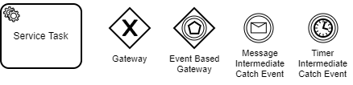
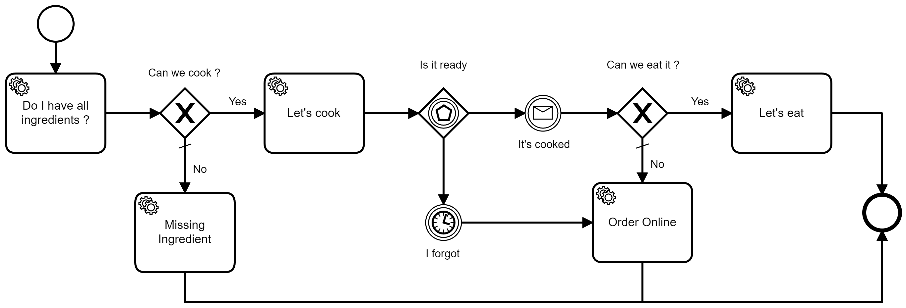
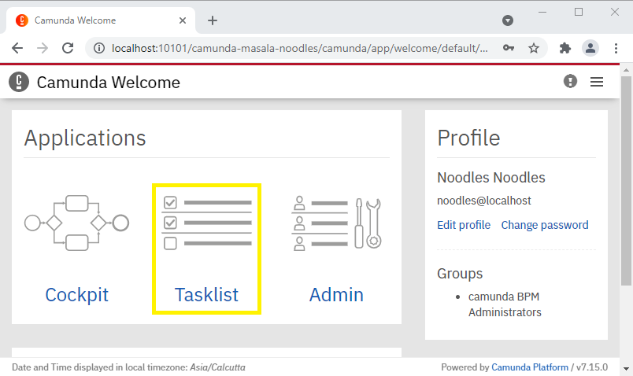
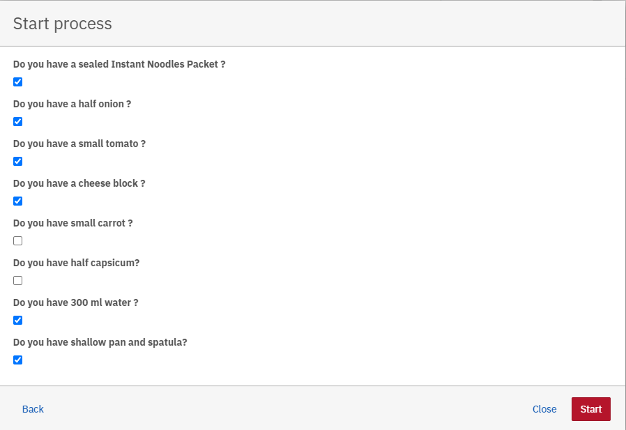
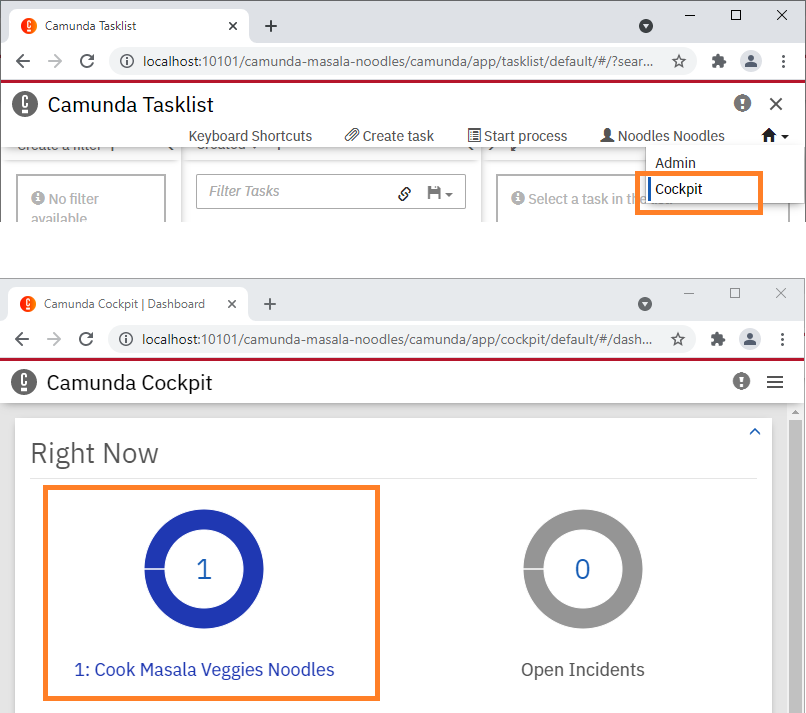
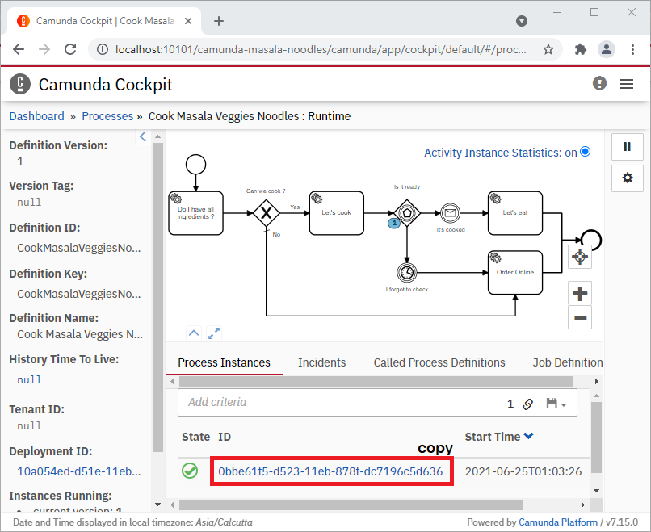
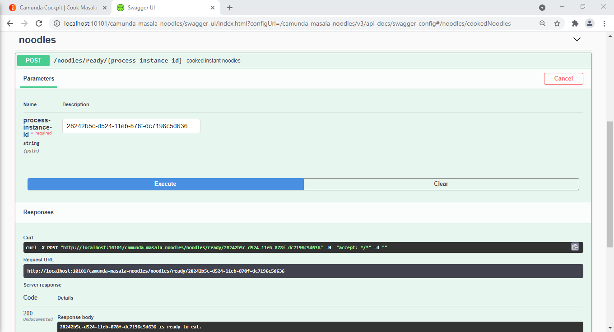

# Cook Veg Masala Noodles using Camunda Workflow
***


## Introduction:
This standalone process application is an example using [Camunda Workflow](https://camunda.com/) & [Springboot](https://spring.io/projects/spring-boot) with JUnit5 Test cases. As for the use case, we will try to _cook veg masala instant noodles_ else order from our favorite restaurant if we fail. 

_**Note:** You may see that some cooking steps may not be intuitive, but they are added to make use of features of camunda._ 

Out of the [BMPN 2.0 Implementations](https://docs.camunda.org/manual/7.15/reference/bpmn20/), we have used below in our use-case to reach a solution:


- `Service Tasks`: A Service Task is used to invoke services. We have used `JavaDelegate` interface to delegate process.   
- `Gateway`: Gateways control token flow in a process. They allow modeling decisions based on data and events.  
- `Event Based Gateway`: The event-based Gateway allows you to make a decision based on events. Each outgoing sequence flow of the gateway needs to be connected to an intermediate catching event.
- `Message Intermediate Catch Event`: Message events are events which reference a named message. A message has a name and a payload.
- `Timer Intermediate Catch Event`: Timer events are events which are triggered by a defined timer. They can be used as start event, intermediate event or boundary event.


### Use Case: Veg Masala Noodles Cooking Flow: 


- We start by checking that we have minimum ingredients, where instant noodles, water, pan and spatula are mandatory. Vegetables, Cheese etc are optional to make instant noodles.
- If the minimum ingredients are available then we put everything in pan, give it a stir, close it with a lid and keep it over heat. (Use your preference there).
- If you smell it nice then open the lid and check if it's cooked.  
- If you get busy with something else and you forget to check it, then after 15 minutes cooking timer will expire, and you have to order online as noodles have burnt.
- Luckily, if you see that it's cooked well, then you can eat it. Else.. Sorry, but your efforts are wasted, and you need to order online. Enjoy cooking!!

With that we reach end of our non-intuitive flow to cook my instant noodles. By the way, that's how I cook instant noodles, and they turn out good most of the times. 


## Code Configuration

### Camunda Springboot Initializer

Camunda Springboot project can be created by [Camunda Platform Initializer](https://start.camunda.com/) which contains Spring Boot framework. This makes Spring ready to work inside your camunda workflow application. 

These starters pre-configure the Camunda process engine, REST API and Web applications, so they can easily be used in the standalone process application.

For detailed notes and guides on setup, refer [Camunda Docs-Springboot](https://docs.camunda.org/get-started/spring-boot/)

### Default Ports

On systems running the `API`, it is recommended to use the below port for starting an instance of the API.

> `10101` – default api listening port

### API Build & deploy from GIT repo
Below section would cover high level tasks required to configure and deploy api jar using Apache Maven

1. Clone repository on local system. By default, jars would be taken from Maven Central Repository.
2. Update properties in logback-spring.xml, application.yaml if applicable
3. Build with maven task `mvnw clean install`
4. Copy .jar file from /target/ to your `deployment-directory`
5. Environment specific `application.yaml` & `logback-spring.xml` are to be modified and placed in deployment-directory along with `.jar` if applicable
6. Start execution with `java -jar camunda-masala-noodles-<version>.jar`
7. Logs are generated in deployment-directory/logs folder with file name 'camunda-masala-noodles-logger.log' or as mentioned in logback-spring.xml

## Testing it out

### Run the Springboot application with maven

- You can follow above steps in order to compile, build, package and install jar using maven.

- Use command `mvnw clean install` to build and install the jar 
  
- Use command `mvnw spring-boot:run` to run the springboot application. 

- Alternatively you can navigate to file [MasalaNoodlesApplication](./src/main/java/com/noodles/MasalaNoodlesApplication.java) and start the application. 

- If every thing works then you should see below log in your console 
```
2021-06-25 00:27:50,315 INFO  [main] org.springframework.boot.web.embedded.tomcat.TomcatWebServer: Tomcat started on port(s): 10101 (http) with context path '/camunda-masala-noodles'
2021-06-25 00:27:50,335 INFO  [main] com.noodles.MasalaNoodlesApplication: Started MasalaNoodlesApplication in 22.716 seconds (JVM running for 25.565)
2021-06-25 00:27:50,340 INFO  [main] org.camunda.bpm.engine.jobexecutor: ENGINE-14014 Starting up the JobExecutor[org.camunda.bpm.engine.spring.components.jobexecutor.SpringJobExecutor].
2021-06-25 00:27:50,344 INFO  [JobExecutor[org.camunda.bpm.engine.spring.components.jobexecutor.SpringJobExecutor]] org.camunda.bpm.engine.jobexecutor: ENGINE-14018 JobExecutor[org.camunda.bpm.engine.spring.components.jobexecutor.SpringJobExecutor] starting to acquire jobs
```
- Refer to [running-your-application](https://docs.spring.io/spring-boot/docs/1.5.16.RELEASE/reference/html/using-boot-running-your-application.html) for more help with running boot application.

### Instantiate new process to make veg masala noodles

#### 1. Open & Login Camunda in Browser 

- On your local machine, you can access Camunda using [Camunda Home Page](http://localhost:10101/camunda-masala-noodles) url
- Credentials are configured in [application.yaml](./src/main/resources/application.yaml) file in key `camunda.bpm.admin-user`. Default credentials are 
  > `username:` noodles   
  `password:` noodles
  


#### 2. Start 'Cook Masala Veggies Noodles' process

- Click on `TaskList` in welcome page  



- In top right corner, we have the menu. Click `Start process` to select the process to be started. 
  


- Click on `Cook Masala Veggies Noodles` which is the process we are about to test

#### 3. Input the details to start process instance

- We will now be presented with a `form` to select the ingredients we have. Based on our input, workflow will decide the course of action. _You can check console logs to see what happened with your process._



#### 4. Navigate to Camunda Cockpit 

- `Cockpit` helps us to visualise which step our process is. It would also give us the process instance id. 



- You can now click on `Cook Masala Veggies Noodles` Process Definition to view the process. Copy the process instance id. 



> Checking of ingredients process will end and cooking process will begin. In case you do not see your process in cockpit then, check logs on console. It would be mainly due to the fact that you do not have enough ingredients to cook instant noodles. In that case, you have to order online.

### Once cooked call the process using the instance id

#### 1. Open Swagger API Browser

- While you were busy with your mobile, suddenly you remember you have kept instant noodles to cook. If your process has not ended yet i:e noodles are not burnt and they are ready to eat then you can trigger an api to indicate to process that you cooked noodles. 

- URL to access [Swagger API](http://localhost:10101/camunda-masala-noodles/swagger-ui.html)

#### 2. Indicate Noodles are cooked by passing the process instance id

- Click on `Try it out` to enable the API. The process instance id that was copied from cockpit, goes into the path parameter. 

- Click `Execute` to send the request. You can check the response which will say `<process-instance-id> is ready to eat. `



- If you want to read more about swagger, then you can go through [tutorial](https://sourabhparsekar.medium.com/open-api-specification-swagger3-fc9ad3bbacdd)

### Check Logs

- In the end, all the steps we did will be tracked via the logs in the console. If you filter the logs using keyword `workflow-service-info` then you would see below 


Logs for **Process instantiation** 
```
Timestamp:1624563683397:workflow-service-info:Check Ingredients:Check ingredients to make veg masala noodles
Timestamp:1624563683397:workflow-service-info:Check Ingredients:we can make veg masala noodles
Timestamp:1624563683400:workflow-service-info:Prepare Noodles:Follow below to make veg masala noodles
Timestamp:1624563683400:workflow-service-info:STEP 1:Take a deep-bottomed pan over medium flame and add water in it and bring it to a boil.
Timestamp:1624563683400:workflow-service-info:STEP 2:While the water starts to boil, check if you received IMs on your mobile.
Timestamp:1624563683400:workflow-service-info:STEP 3:Once the water boils, add chopped vegetables, add 1 packet of instant noodles and stir it.
Timestamp:1624563683401:workflow-service-info:STEP 4:Add the taste-maker to it and give it another stir
Timestamp:1624563683401:workflow-service-info:STEP 5:Close the lid
Timestamp:1624563683401:workflow-service-info:Cooking in Process:You can play with your mobile as it cooks for sometime...
```

Logs for **Process continuation success**
```
Timestamp:1624563718006:workflow-service-info:Noodles Cooked:Cooking done for process instance id: 28242b5c-d524-11eb-878f-dc7196c5d636
Timestamp:1624563718030:workflow-service-info:Eat Noodles:Veg masala noodles is ready. Let's eat... But first serve it..
Timestamp:1624563718030:workflow-service-info:Eat Noodles:Transfer to a serving bowl and sprinkle a pinch of chaat masala or oregano over the noodles to make it even more flavorful.
Timestamp:1624563718030:workflow-service-info:Eat Noodles:Serve it hot to enjoy!! 
```

Logs for **Process continuation failure**
```
Timestamp:1624563560428:workflow-service-info:Order Online:Veg masala noodles was no success.. Let's order online...
Timestamp:1624563560429:workflow-service-info:Order Online:Ordering is not part of this flow yet... Try your local apps...
```

Logs for **insufficient ingredients**
```
Timestamp:1624562624142:workflow-service-info:Check Ingredients:Check ingredients to make veg masala noodles
Timestamp:1624562624142:workflow-service-error:Check Ingredients:we cannot make veg masala noodles as required ingredient is missing. Instant Noodles, Water, Pan and Spatula are required.
Timestamp:1624562624144:workflow-service-info:Order Online:Veg masala noodles was no success.. Let's order online...
Timestamp:1624562624145:workflow-service-info:Order Online:Ordering is not part of this flow yet... Try your local apps...
```

_Hope you enjoy the wonderful journey of cooking veg masala instant noodles using camunda workflow. Until next time, happy cooking !!_


## Appendix - Deployment as Docker container

To deploy API as Docker Container refer [Docker-Image-Deployment](./documentation/deployment/Readme.md)
